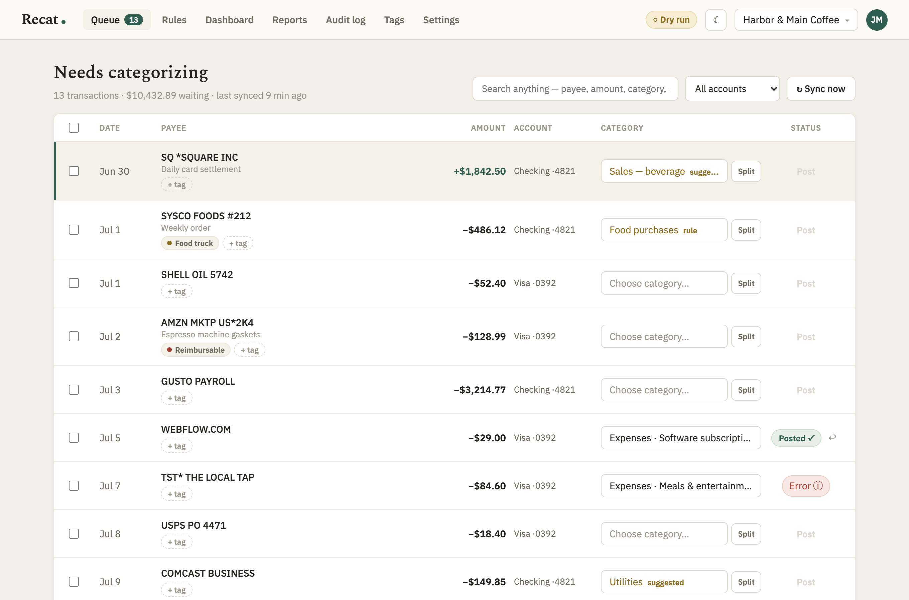
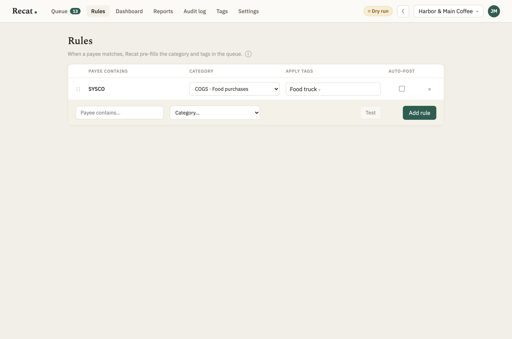
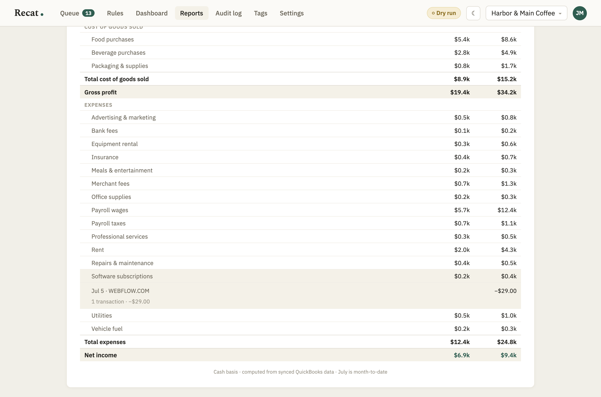
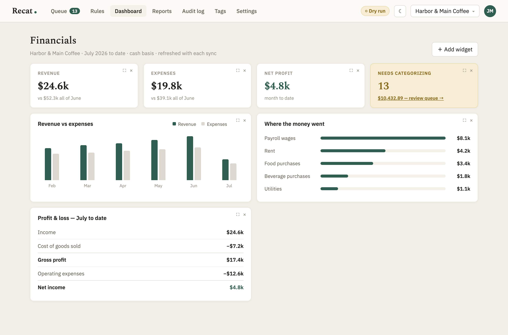
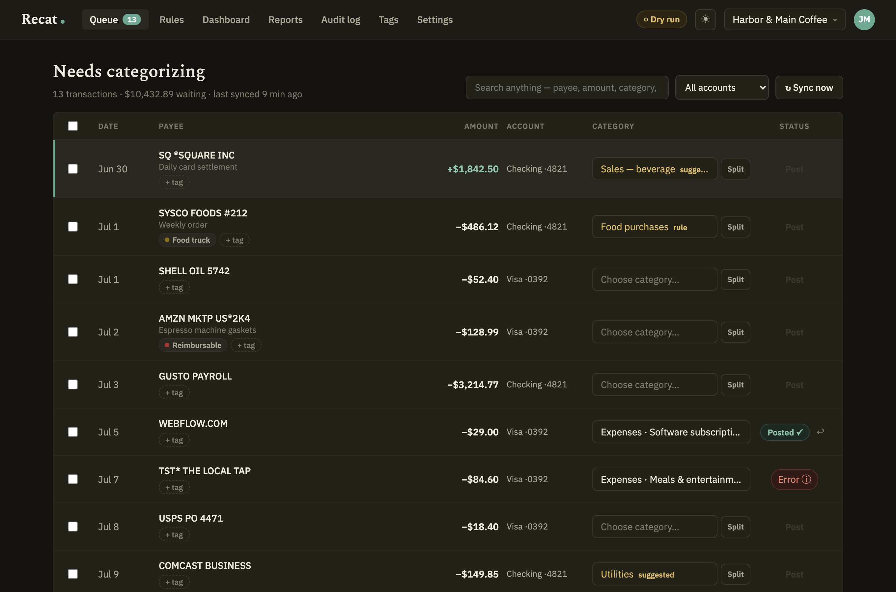
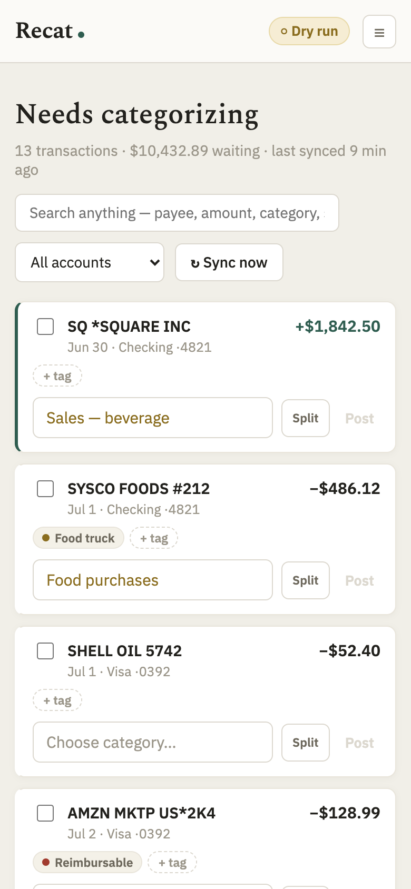

# Recat QBO

**Self-hosted, open-source transaction categorization and review for QuickBooks Online.**

Give your team a simple queue for categorizing uncategorized QuickBooks
transactions—without giving everyone a QuickBooks login. Recat QBO supports
rules, splits, transfers, bulk posting, reporting, private tags, dry-run mode,
and a complete append-only audit trail.

The self-hosted alternative to per-client SaaS tools like Uncat. Your credentials, your server, your data — no third-party service in the middle, no telemetry, ever.



## How it works

1. A QuickBooks bank rule auto-adds bank feed items to a **holding account** (e.g. "Ask My Accountant")
2. Recat syncs everything in that account to your own server
3. Your team categorizes in the web UI — magic-link sign-in, no passwords
4. Recat updates each transaction in QuickBooks via the API: correct category, splits, or transfers
5. Every write is recorded in an append-only audit log before it happens; dry-run mode available

> **Why a holding account?** Intuit's API deliberately can't see the bank feed "For Review" tab. Accepting feed items into a holding account is the standard workaround — it's how the commercial tools do it too. Set up one auto-add bank rule and Recat handles everything downstream.

## Features

**The queue** — the screen that does 90% of the work
- Searchable category picker fed by your real chart of accounts, with suggestions pinned on top
- Suggestions from three sources, first match wins: your **rules**, each payee's **history**, or an optional **AI endpoint** you control (OpenAI-compatible — works with OpenAI, Anthropic, Mistral, or local Ollama)
- **Split** any transaction across multiple categories, each line with its own tags
- **Transfer detection** — matching in/out pairs get a one-click "record as transfer"
- **Bulk mode**: select rows, assign one category, post them all
- **Undo** any post for 30 days — the transaction moves back to the queue, with an audit entry
- Full keyboard flow: `j`/`k` move, `x` select, `c` category, `t` tags, `Enter` post, `Esc` close
- Search everything — payee, memo, amount, category, status, account

**Rules that stay predictable**
- "Payee contains X → category Y (+ tags)", with optional auto-post (still respects dry-run)
- Drag-to-reorder priority: when several rules match, **the topmost wins** — and the queue shows you when a transaction matched more than one
- **Test before saving**: dry-run a rule against your pending and past transactions, with conflict warnings
- One-tap rule creation right after you categorize a new payee



**Reports that can't drift from QuickBooks**
- P&L and Balance Sheet rendered from **QuickBooks' own Reports API** — the numbers are Intuit's, so what Recat shows always matches what QuickBooks shows
- **Click any statement row** to drill into its underlying transactions without opening QuickBooks
- QuickBooks-style controls: period, columns by month, compare to previous month / same month last year, cash or accrual
- **Custom & tags reports**: slice by tag, category, or bank account — split transactions attribute each line's amount to its own category and tags
- Save and reload named report configurations



**Dashboard**
- Revenue / expenses / net profit / needs-categorizing KPI cards, revenue-vs-expenses chart, expense breakdown, P&L summary
- Drag to rearrange, resize, add and remove widgets — layout saved per user



**Tags — dimensions without the QuickBooks upsell**
- Private labels for locations, projects, owners, anything — never written to QuickBooks, so you don't need Intuit's class-tracking plan
- Any color, unlimited tags per transaction (or per split line), fully reportable

**Team & roles**
- Magic-link sign-in — no passwords stored, ever
- **Per-company roles**: a user can be admin of one company and viewer of another
  | Capability | Viewer | Categorizer | Admin |
  |---|:-:|:-:|:-:|
  | Dashboard & Reports | ✓ | ✓ | ✓ |
  | Queue: categorize, post, undo | | ✓ | ✓ |
  | Tags & Rules | | ✓ | ✓ |
  | Audit log | | ✓ | ✓ |
  | Company settings, team, dry-run | | | ✓ |
- An **instance admin** manages the deployment: Intuit keys, email, users, connecting companies
- Multi-company from day one — connect as many QuickBooks companies as you like and switch from the nav

**Safety, first-class**
- **Dry-run mode** (default on): Recat logs the exact payload it *would* send to QuickBooks — but writes nothing. Turn it off when you trust the setup.
- **Append-only audit log**: every write recorded before it happens — who, what, before → after, exact payload. Nothing can be edited or deleted; CSV export included.
- Fresh-read discipline: every write re-fetches the entity first (QuickBooks optimistic locking), retries once on conflict, and surfaces anything unexpected instead of guessing
- Transactions fixed directly inside QuickBooks drop out of the queue automatically — QuickBooks stays the source of truth
- OAuth tokens and secrets encrypted at rest (AES-256-GCM)

**Fits your infrastructure**
- **Polling sync by default** (no public URL needed, 5–60 min interval) — webhooks optional if you have HTTPS
- Nightly full reconcile
- Daily digest by email and/or Slack when transactions are waiting
- Light & dark themes, comfortable/compact density, fully responsive (real phone layout with a hamburger menu, stacked cards, no horizontal scrolling)

<p>
  
  
</p>

## Quick start

```bash
git clone https://github.com/tx-joshg/recat-qbo.git && cd recat-qbo
cp .env.example .env        # set SESSION_SECRET + ENCRYPTION_KEY
docker compose up -d
open http://localhost:3001  # first-run setup wizard takes it from here
```

The wizard walks you through everything: admin account → Intuit keys → email (SMTP, skippable) → connect QuickBooks → pick holding accounts → first sync. You'll need free QuickBooks API credentials from the [Intuit Developer Portal](https://developer.intuit.com) — **[docs/intuit-setup.md](docs/intuit-setup.md) walks you through it step by step**, including the production-access questionnaire.

### Try it without QuickBooks (demo mode)

Set `QBO_MOCK=true` in `.env` and Recat runs against a built-in fake QuickBooks with two sample companies — the full loop works (sync, categorize, post, undo, splits, transfers, reports) without an Intuit account. Magic links appear as a one-click button when SMTP isn't configured.

**Switching to the real thing:** set `QBO_MOCK=false`, add your real Intuit credentials (via `.env` or the setup wizard), and restart. The demo companies are automatically disconnected — history preserved. For a completely fresh start, reset the database instead (`npx prisma migrate reset`).

### Local development

```bash
npm install
createdb recat && npx prisma migrate dev
npm run seed                # demo data (QBO_MOCK=true)
npm run dev                 # server :3001 + client :5173
npm test                    # server unit tests
```

See [CONTRIBUTING.md](CONTRIBUTING.md) for the ground rules.

## Configuration

Everything can be configured in the UI (setup wizard / Settings). Env vars are optional overrides for infra-as-code deployments and take precedence when set. The essentials:

| Variable | Purpose |
|---|---|
| `SESSION_SECRET` | Random 32+ chars — signs sessions. **Required in production.** |
| `ENCRYPTION_KEY` | 64 hex chars — encrypts tokens/secrets at rest. **Required in production.** |
| `DATABASE_URL` | PostgreSQL connection string |
| `APP_URL` | Public URL of this deployment (used in links + OAuth redirect) |
| `QBO_CLIENT_ID` / `QBO_CLIENT_SECRET` | Intuit app keys (or enter in the wizard) |
| `QBO_ENVIRONMENT` | `sandbox` or `production` |
| `QBO_MOCK` | `true` = built-in demo QuickBooks, no Intuit account needed |
| `SMTP_HOST/PORT/USER/PASS/FROM` | Magic-link + digest email (or configure in the wizard/Settings) |
| `SLACK_WEBHOOK_URL` | Optional digest notifications to Slack |
| `DRY_RUN` | `true` = never write to QuickBooks, log payloads instead |

Full list with comments in [.env.example](.env.example).

## Architecture

React (Vite) client · Express + TypeScript server · PostgreSQL via Prisma · one Docker image. The server owns all QuickBooks communication (tokens never reach the browser). Both real-QuickBooks and demo modes run the exact same sync/write-back code behind one client interface. Design decisions and their rationale are logged in [docs/decisions.md](docs/decisions.md).

## FAQ

**Why can't it read the bank feed directly?** Intuit's API doesn't expose the "For Review" tab to anyone. Every tool in this space works from holding accounts — see *How it works* above.

**Can it write my tags to QuickBooks?** No — QuickBooks tags are read-only via the API, which is why Recat's tags are deliberately local. If you need dimensions inside QuickBooks, use Classes/Locations there; Recat's tags are for everything else.

**Is production Intuit access hard to get?** There's a one-time app assessment questionnaire (even for private apps). It's friction, not a blocker — [docs/intuit-setup.md](docs/intuit-setup.md) includes a walkthrough with suggested answers. Sandbox keys are instant.

**What if two tools watch the same holding account?** They'll fight. If you're replacing Uncat or similar, disconnect it for that company first.

## License

AGPL-3.0 — free to use, self-host, and modify. If you offer a modified version as a network service, you must share your changes.
