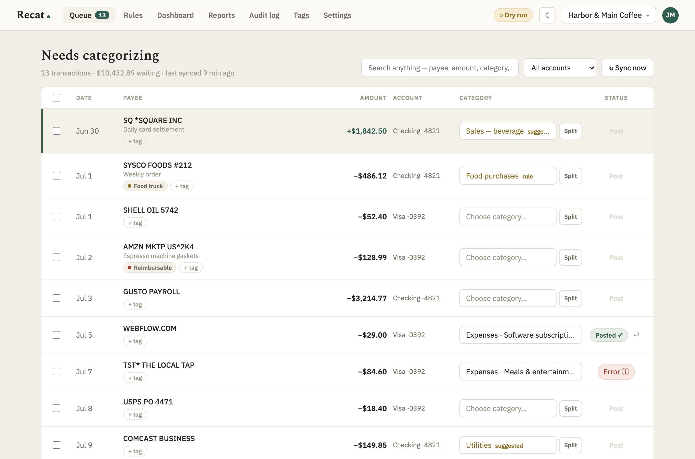
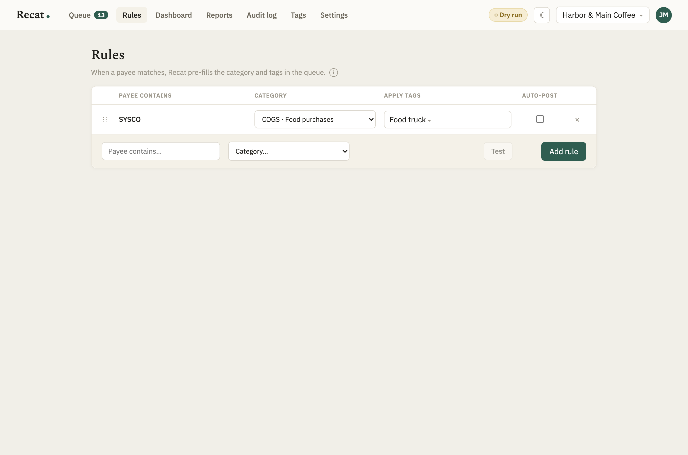
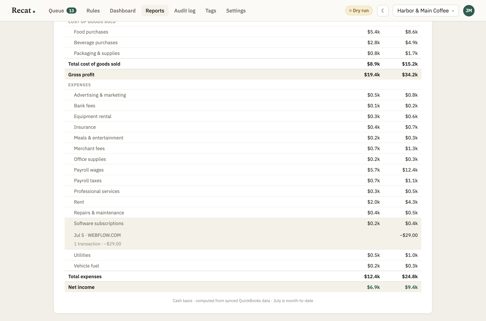
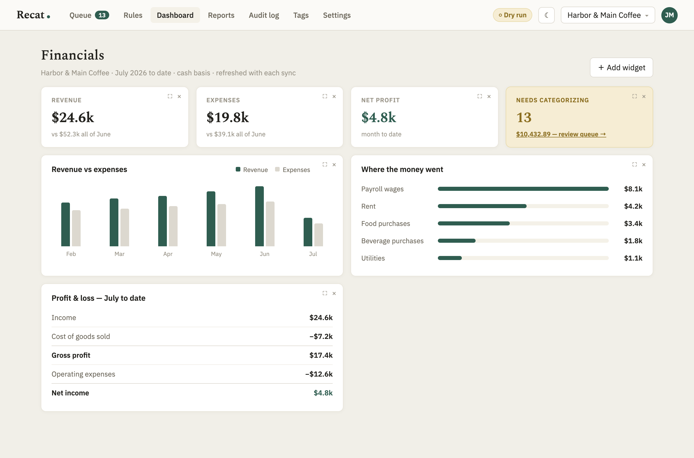
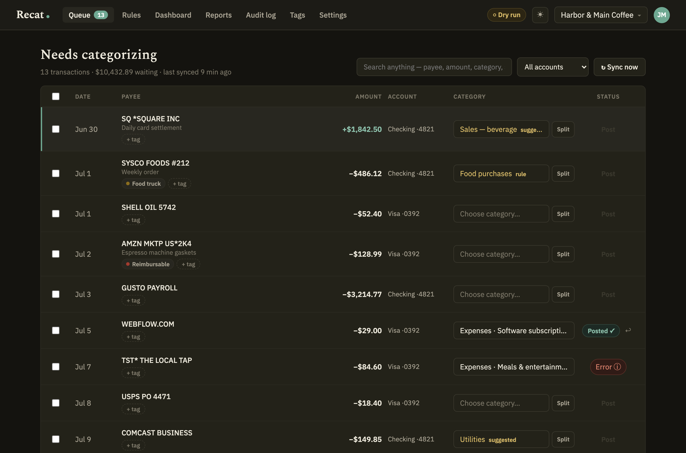
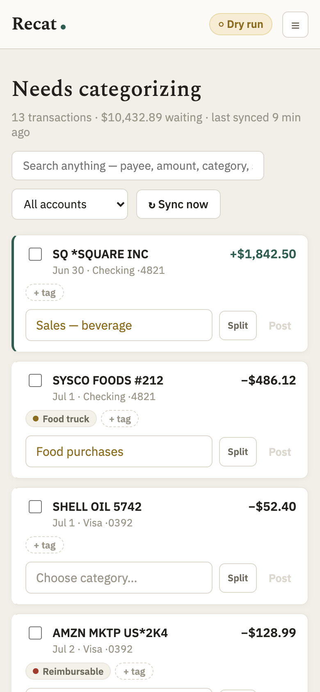

<p align="center">
  
</p>

# Recat QBO

**Self-hosted, open-source transaction categorization and review for QuickBooks Online.**

Give your team a simple queue for categorizing uncategorized QuickBooks
transactions—without giving everyone a QuickBooks login. Recat QBO supports
rules, splits, transfers, bulk posting, reporting, private tags, dry-run mode,
and a complete append-only audit trail.

The self-hosted alternative to per-client SaaS tools like Uncat. Your credentials, your server, your data — no third-party service in the middle, no telemetry, ever.

[](https://railway.com/deploy/recat-qbo)

One click provisions the app + PostgreSQL with generated secrets. The setup wizard then asks how you want to start — **try the demo** (a built-in fake QuickBooks, nothing to configure) or **connect your real QuickBooks** with your own free Intuit keys. Demo and real companies can coexist; switch or add either at any time. Prefer your own server? See [Quick start](#quick-start).



## How it works

1. A QuickBooks bank rule auto-adds bank feed items to a **holding account** (e.g. "Ask My Accountant")
2. Recat syncs everything in that account to your own server
3. Your team categorizes in the web UI — magic-link sign-in, no passwords
4. Recat updates each transaction in QuickBooks via the API: correct category, splits, or transfers
5. Every write is recorded in an append-only audit log before it happens; dry-run mode available

> **Why a holding account?** Intuit's API deliberately can't see the bank feed "For Review" tab. Accepting feed items into a holding account is the standard workaround — it's how the commercial tools do it too. Set up one auto-add bank rule and Recat handles everything downstream.

## Features

**The queue** — the screen that does 90% of the work
- Searchable category picker fed by your real chart of accounts, with suggestions pinned on top
- Suggestions from three sources, first match wins: your **rules**, each payee's **history**, or an optional **AI endpoint** you control (OpenAI-compatible — works with OpenAI, Anthropic, Mistral, or local Ollama)
- **Split** any transaction across multiple categories, each line with its own tags
- **Sales tax on purchases** — pick a tax code from your company's real QuickBooks tax references, per transaction or per split line. Recat reads the posted result back from QuickBooks and only marks the transaction done once the tax it recorded matches what you chose
- **Transfer detection** — matching in/out pairs get a one-click "record as transfer"
- **Bulk mode**: select rows, assign one category, post them all
- **Undo** any post for 30 days — the transaction moves back to the queue, with an audit entry
- Full keyboard flow: `j`/`k` move, `x` select, `c` category, `t` tags, `Enter` post, `Esc` close
- Search everything — payee, memo, amount, category, status, account

**Rules that stay predictable**
- "Payee contains X → category Y (+ tags)", with optional auto-post (still respects dry-run)
- Drag-to-reorder priority: when several rules match, **the topmost wins** — and the queue shows you when a transaction matched more than one
- **Test before saving**: dry-run a rule against your pending and past transactions, with conflict warnings
- One-tap rule creation right after you categorize a new payee



**Reports that can't drift from QuickBooks**
- P&L and Balance Sheet rendered from **QuickBooks' own Reports API** — the numbers are Intuit's, so what Recat shows always matches what QuickBooks shows
- **Click any statement row** to drill into its underlying transactions without opening QuickBooks
- QuickBooks-style controls: period, columns by month, compare to previous month / same month last year, cash or accrual
- **Custom & tags reports**: slice by tag, category, or bank account — split transactions attribute each line's amount to its own category and tags
- Save and reload named report configurations



**Dashboard**
- Revenue / expenses / net profit / needs-categorizing KPI cards, revenue-vs-expenses chart, expense breakdown, P&L summary
- Drag to rearrange, resize, add and remove widgets — layout saved per user



**Tags — dimensions without the QuickBooks upsell**
- Private labels for locations, projects, owners, anything — never written to QuickBooks, so you don't need Intuit's class-tracking plan
- Any color, unlimited tags per transaction (or per split line), fully reportable

**Team & roles**
- Ordinary users sign in with passwordless magic links by default — optional local-admin access uses a deployment-managed credential that Recat never stores in its database
- **Per-company roles**: a user can be admin of one company and viewer of another
  | Capability | Viewer | Categorizer | Admin |
  |---|:-:|:-:|:-:|
  | Dashboard & Reports | ✓ | ✓ | ✓ |
  | Queue: categorize, post, undo | | ✓ | ✓ |
  | Tags & Rules | | ✓ | ✓ |
  | Audit log | | ✓ | ✓ |
  | Company settings, team, dry-run | | | ✓ |
- An **instance admin** manages the deployment: Intuit keys, email, users, connecting companies
- Multi-company from day one — connect as many QuickBooks companies as you like and switch from the nav

**MCP server — let an AI assistant work your books**
- Recat speaks the [Model Context Protocol](https://modelcontextprotocol.io) at `/mcp`, so an MCP client (Claude, or anything else that speaks it) can read your queue and categorize through the same verified paths the UI uses
- **Reads**: companies, transactions, categories, tags, rules, tax codes, and transfer candidates
- **Writes are two-phase.** A client calls `prepare_categorization` (or `prepare_transfer` / `prepare_undo`) and gets back a validated summary — per-line subtotal, tax and total, the tax treatment, and tag counts — then must `commit_` it as a separate step. Nothing writes to QuickBooks on a single blind tool call, and every commit is read back and verified. Note the preview confirms the money, not the full proposal: category and tax-code identifiers, memos and individual tags aren't echoed back
- **These tokens can change your books.** A token grants every MCP operation the user's roles allow — so a leaked one can recategorize real transactions. It can't reach the rest of the app: bearer auth is mounted only at `/mcp`, so user and team management, company and instance settings, and reporting stay session-only. Treat it like a password: one per client, revoked when you're done
- Create and revoke tokens in **Settings → MCP access tokens**. They're shown once, stored only as a SHA-256 digest, expire 90 days after creation, and honour per-company roles, dry-run, and per-token rate limits. (The API accepts 1–365 days; the Settings screen always issues 90.)

**Safety, first-class**
- **Dry-run mode** (default on): Recat logs the exact payload it *would* send to QuickBooks — but writes nothing. Turn it off when you trust the setup.
- **Append-only audit log**: every write recorded before it happens — who, what, before → after, exact payload. Nothing can be edited or deleted; CSV export included.
- Fresh-read discipline: every write re-fetches the entity first (QuickBooks optimistic locking), retries once on conflict, and surfaces anything unexpected instead of guessing
- Transactions fixed directly inside QuickBooks drop out of the queue automatically — QuickBooks stays the source of truth
- OAuth tokens and secrets encrypted at rest (AES-256-GCM)

**Fits your infrastructure**
- **Polling sync by default** (no public URL needed, 5–60 min interval) — webhooks optional if you have HTTPS
- Nightly full reconcile
- Daily digest by email and/or Slack when transactions are waiting
- Light & dark themes, comfortable/compact density, fully responsive (real phone layout with a hamburger menu, stacked cards, no horizontal scrolling)

<p>
  
  
</p>

## Quick start

```bash
git clone https://github.com/tx-joshg/recat-qbo.git && cd recat-qbo
cp .env.example .env        # set SESSION_SECRET + ENCRYPTION_KEY
docker compose up -d
open http://localhost:3001  # first-run setup wizard takes it from here
```

Prebuilt images are published to `ghcr.io/tx-joshg/recat-qbo` for **`linux/amd64` and `linux/arm64`**, so the same tag works on an x86 server, an Apple Silicon Mac, or a Raspberry Pi running a 64-bit OS. There is no 32-bit (`linux/arm/v7`) image.

The wizard walks you through everything: how you want to start (demo or real) → admin account → Intuit keys (real path only) → email (SMTP, skippable) → connect QuickBooks → pick holding accounts → first sync. For the real path you'll need free QuickBooks API credentials from the [Intuit Developer Portal](https://developer.intuit.com) — **[docs/intuit-setup.md](docs/intuit-setup.md) walks you through it step by step**, including the production-access questionnaire.

### Recover access without SMTP

If email delivery is unavailable, an operator with shell access can print a
fresh, single-use sign-in link for any existing Recat user:

```bash
docker compose exec app npm run login-link -- admin@example.com
```

The link expires in 15 minutes and can be used only once. It is created by the
same token service as emailed links.

For Umbrel and other LAN deployments, you can also enable a conventional local
administrator login:

```dotenv
LOCAL_ADMIN_EMAIL=admin@example.com
LOCAL_ADMIN_PASSWORD=a-long-random-password
```

Both values are required. The email must already be an instance administrator,
and the password must contain at least 12 characters. Umbrel packages should
use their generated `${APP_PASSWORD}` value. Recat does not store this password
in its database.

If Recat sits behind a reverse proxy, set `TRUSTED_PROXY_IPS` to a
comma-separated list of the exact immediate proxy peer IPs. It defaults to
empty, trusting none; direct or untrusted requests ignore `X-Forwarded-For`.
An Umbrel or other reverse-proxy package should set its immediate app-proxy IP
so forwarded clients retain separate local-admin rate-limit buckets.

`ALLOW_DEV_LOGIN=true` remains available unchanged for development. It is not a
recovery substitute: it returns magic links in API responses for every user,
whereas local-admin login is limited to one configured instance administrator.

### Try it without QuickBooks (the demo)

Pick **"Try the demo"** on the setup wizard's first step — on any deployment, no env var required. Recat connects a built-in fake QuickBooks with two sample companies and the full loop works (sync, categorize, post, undo, splits, transfers, reports, dashboard) without an Intuit account. Magic links appear as a one-click button while only demo companies are connected and SMTP isn't configured.

**Switching to the real thing:** enter your Intuit credentials (Settings → QuickBooks API access, or re-run the wizard's real path) and connect your real books — no restart, no flags. Demo and real companies coexist side by side (demo ones wear a small `demo` badge); disconnect the demo companies from Settings whenever you're done with them. The moment a real company is connected, magic links stop appearing in the UI and go through email (or the server log) only.

`QBO_MOCK=true` remains for local development only — it gates the `npm run seed` demo seed.

### Local development

```bash
npm install
createdb recat && npx prisma migrate dev
npm run seed                # demo data (QBO_MOCK=true)
npm run dev                 # server :3001 + client :5173
npm test                    # full server + client test suite
```

See [CONTRIBUTING.md](CONTRIBUTING.md) for the ground rules.

## Configuration

Everything can be configured in the UI (setup wizard / Settings). Env vars are optional overrides for infra-as-code deployments and take precedence when set. The essentials:

| Variable | Purpose |
|---|---|
| `SESSION_SECRET` | Random 32+ chars — signs sessions. **Required in production.** |
| `ENCRYPTION_KEY` | 64 hex chars — encrypts tokens/secrets at rest. **Required in production.** |
| `DATABASE_URL` | PostgreSQL connection string |
| `APP_URL` | Public URL of this deployment (used in links + OAuth redirect) |
| `QBO_CLIENT_ID` / `QBO_CLIENT_SECRET` | Intuit app keys (or enter in the wizard) |
| `QBO_ENVIRONMENT` | `sandbox` or `production` |
| `QBO_MOCK` | Local dev only: enables the demo seed. The wizard offers demo companies on every deployment without it |
| `SMTP_HOST/PORT/USER/PASS/FROM` | Magic-link + digest email (or configure in the wizard/Settings) |
| `LOCAL_ADMIN_EMAIL` / `LOCAL_ADMIN_PASSWORD` | Optional local login for one existing instance administrator; set both, with a random password of at least 12 characters. Umbrel maps its generated `${APP_PASSWORD}` to `LOCAL_ADMIN_PASSWORD` |
| `TRUSTED_PROXY_IPS` | Optional comma-separated exact immediate reverse-proxy peer IPs. Empty (the default) trusts none and ignores `X-Forwarded-For` from direct or untrusted peers |
| `SLACK_WEBHOOK_URL` | Optional digest notifications to Slack |
| `DRY_RUN` | `true` = never write to QuickBooks, log payloads instead — applies to MCP writes too |

Full list with comments in [.env.example](.env.example).

The optional provider-neutral shadow decision core and the exact bookkeeping
fields it can send to an external model are documented in
[docs/autopilot.md](docs/autopilot.md).

MCP access tokens are not env vars — they're issued per user in **Settings → MCP access tokens** and stored only as digests. See the MCP section above before handing one to a client.

## Architecture

React (Vite) client · Express + TypeScript server · PostgreSQL via Prisma · one Docker image. The server owns all QuickBooks communication (tokens never reach the browser). Real and demo companies run the exact same sync/write-back code behind one client interface, chosen per company. Design decisions and their rationale are logged in [docs/decisions.md](docs/decisions.md).

## FAQ

**Why can't it read the bank feed directly?** Intuit's API doesn't expose the "For Review" tab to anyone. Every tool in this space works from holding accounts — see *How it works* above.

**Can it write my tags to QuickBooks?** No — QuickBooks tags are read-only via the API, which is why Recat's tags are deliberately local. If you need dimensions inside QuickBooks, use Classes/Locations there; Recat's tags are for everything else.

**Is production Intuit access hard to get?** There's a one-time app assessment questionnaire (even for private apps). It's friction, not a blocker — [docs/intuit-setup.md](docs/intuit-setup.md) includes a walkthrough with suggested answers. Sandbox keys are instant.

**What if two tools watch the same holding account?** They'll fight. If you're replacing Uncat or similar, disconnect it for that company first.

## License

AGPL-3.0 — free to use, self-host, and modify. If you offer a modified version as a network service, you must share your changes.
